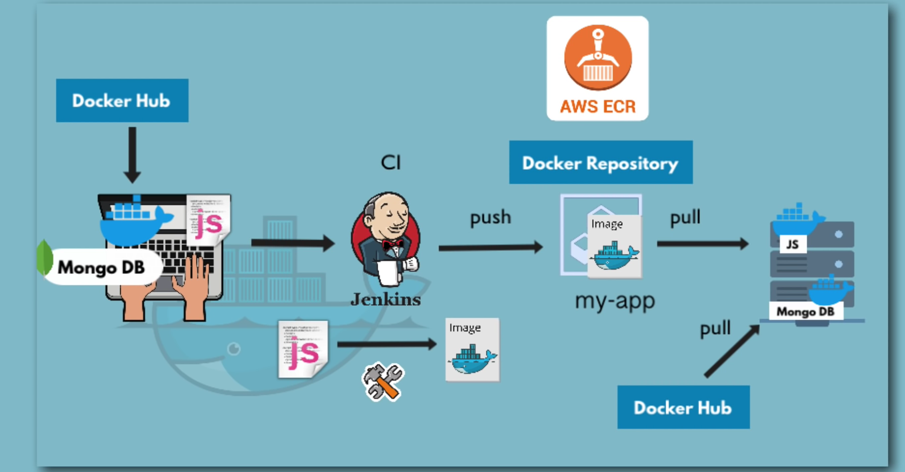

# docker build

docker build -t image_name:tag .
-t → tags the image with a name and version.
. → tells Docker to use the Dockerfile in the current directory.

# docker run

docker run [options] image_name
Common Options

-d → run in detached (background) mode

-p host:container → map ports

--name → naming the container

# docker start/stop

docker start/stop container_name

# docker pull

docker pull image_name

# list running+stopped containers

docker ps -a

# docker images

# docker rm/rmi container/images

# docker compose up

docker-compose -f mongo.yaml up

Meaning:

Use the compose file named mongo.yaml

Start (create & run) all services defined in it

Download images if missing

Create containers, networks, and volumes

Show logs in the terminal

Equivalent English:
“Start everything described in mongo.yaml.”

## docker compose down

docker-compose -f mongo.yaml down

Meaning:

Stop all containers

Remove containers

Remove networks created by docker-compose

Does not delete images

Does not delete named volumes (unless you add --volumes)

Equivalent English:
“Stop and clean up everything created by mongo.yaml.”

# docker login is the command that lets your Docker CLI “prove who you are” so you can push or pull private images.

# pulling a images(general syntax)

docker pull registryDomain/imageName:tag
eg in docker hub: docker pull mongo:4.2 is equivalent to docker.io/library/
mongo:4.2
whereas in AWS ECR
docker pull 520697001743.dkr.ecr.eu-central-1.amazonaws.com/my-app:1.0

# basic workflow of development in docker

